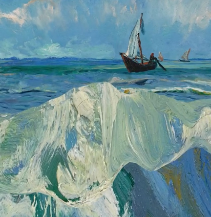
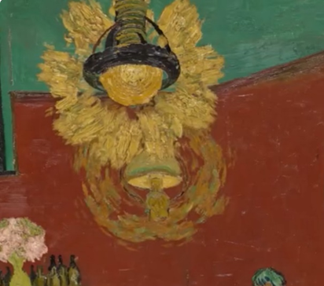
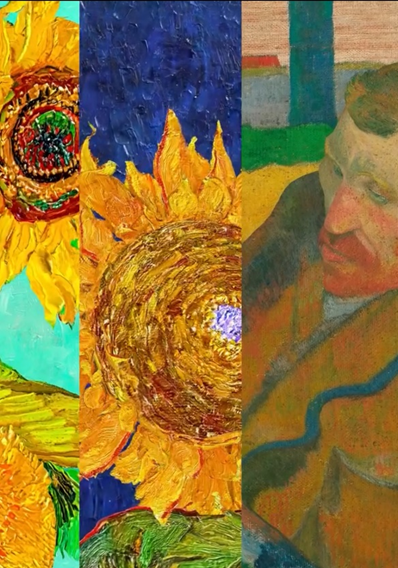
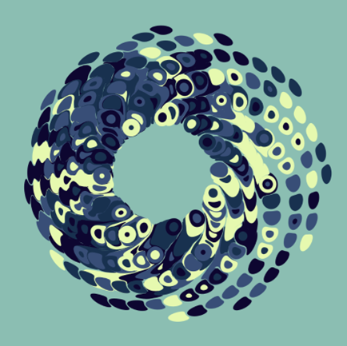
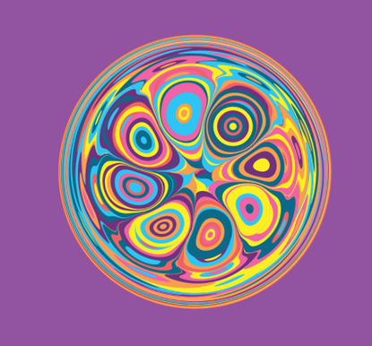
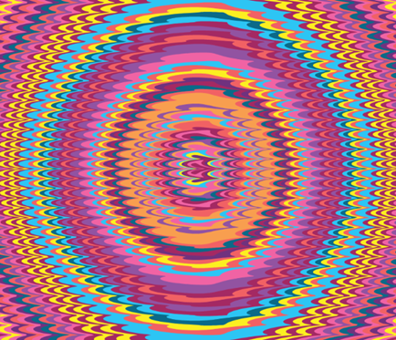

# kelu0334_9103_tut4

## Part 1: Imaging Technique: Fluid Simulation Effect

**1. Videos**
- Video Link 1
[Video 1](https://www.instagram.com/reel/C07DsrXNbJa/?igsh=MTFvdWZubjk2dHlkcA==)
- Video Link 2
[Video 2](https://www.instagram.com/reel/C1Qk-qMtsPv/?igsh=MXN6dTV4bW96cG12OQ==)

**2. Screenshots:**
- Screenshot 1

- Screenshot 2

- Screenshot 3

**3. Discussion**
*Fluid Simulation Effect* is an image technique for simulating the movement of liquids through digital technology. Artist **Andrey Zakirzyanon** uses extensively and creatively this technique to animate static images. *Fluid Simulation Effect* will be the main source of inspiration for my final assignment, as the technique allows elements of my chosen artwork, especially circular patterns, to flow rhythmically on the canvas as if being pushed by wind or current. This dynamic effect will give the work a layered feeling and allow the viewers to experience the aesthetics of the image’s dynamic.

## Part 2: Coding Technique: Mathematical Marbling

**1. Videos**
- Video Link 1
[Video](https://thecodingtrain.com/challenges/183-mathematical-marbling)
- Video Link 2
[Link for Screenshot 1](https://editor.p5js.org/kfahn/sketches/9_zNcBI9Z)
- Video Link 3
[Link for Screenshot 2](https://stitch-bronze-decision.glitch.me/)
- Video Link 4
[Link for Screenshot 3](https://editor.p5js.org/codingtrain/sketches/kUPncgjvO)

**2. Screenshots:**
- Screenshot 1

- Screenshot 2

- Screenshot 3

**3. Discussion**
*Mathematical Marbling* is a coding technique for generating marbling-like textures that work well with *Fluid Simulation Effect* to create dynamic elements. For example, the effect of waves surging in screenshot 1 in Part 1, and the orange light rays around the light bulb in screenshot 2, and the heart of the sunflower in screenshot 3, which are all floating slowly in the videos. In addition to animation, it can also be interactive, such as the example in screenshot3 in Part2, the image can be interacted by mouse press and drag, which can also be my inspiration.